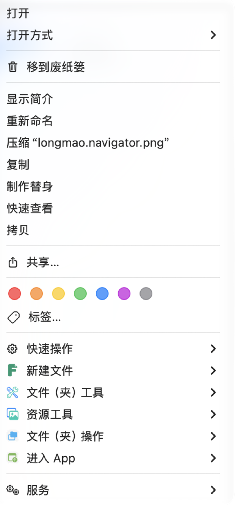
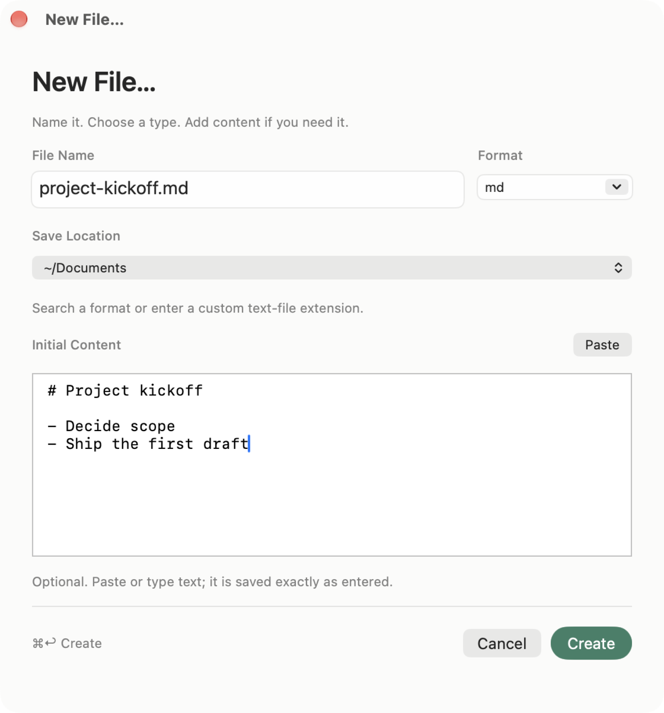
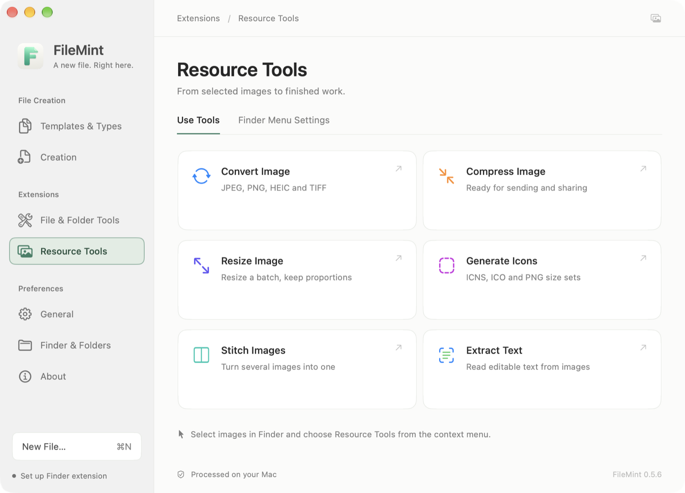
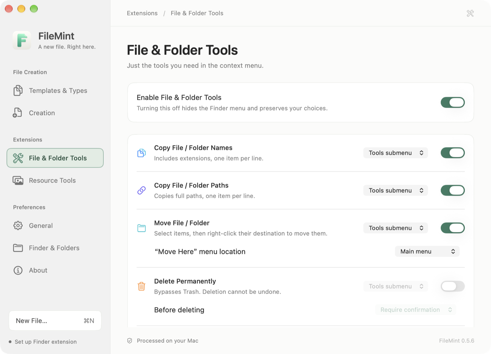

<h1 align="center">FileMint</h1>

<strong>Put file tools back in Finder.</strong> A small native macOS app for creating, processing and organizing files and images.

<a href="README.md"><strong>← 简体中文</strong></a> ｜ <strong>English</strong>

<a href="https://github.com/FileMintApp/FileMint/releases/latest">Download for macOS</a> · <a href="website/">Website source</a> · <a href="docs/INSTALL.md">Installation help</a> · <a href="https://github.com/FileMintApp/FileMint/issues">Report an issue</a>

Swift + AppKit + SwiftUI · Offline file creation

Creating a file should not require opening an editor, choosing Save As and finding your folder again.

FileMint puts the action back in Finder: **right-click, choose a type and your file is there.**
When you need a name, starter content, image processing or selected-item tools, the same native workflow continues.

## What's new in 0.6.0

Finder menus can now reorder **Open with App** entries and place **New File** in the main menu or a submenu. File moves and deletions recheck their sources and destinations, and the Full Disk Access shortcut opens the current System Settings page. Version 0.6.0 supports M-series Macs on macOS 13+; Intel users should remain on 0.5.10.

[0.6.0 release notes](https://github.com/FileMintApp/FileMint/releases/tag/v0.6.0)

## Recent features

- **Open with App**: Add your go-to apps to Finder and open selected files or folders with them.
- **Paste Image as File**: Preview and name a copied screenshot or image, then save it as PNG.
- **Multiple templates per format**: Keep separate content and filenames for one format, with a configurable default template.
- **Word / Excel templates**: Import `.docx` or `.xlsx` and create independent copies with the original formatting and content.
- **Themes and settings**: General now offers Follow System, Light and Dark, with consistent control alignment and interaction styles.

[Full release notes](https://github.com/FileMintApp/FileMint/releases/tag/v0.6.0)

## Why FileMint

| What matters | How FileMint approaches it |
| --- | --- |
| Native experience | Swift + AppKit + SwiftUI; native menus, windows and editing without an embedded web runtime. |
| Small and focused | Small footprint, no account, no subscription and no background folder crawl. |
| Local performance boundary | File creation, image processing and OCR run on your Mac instead of a remote service. |
| Finder context | Right-click the desktop or an authorized folder; the current location is the destination context. |
| Opt-in extensions | File Tools and Resource Tools start off and never disturb the existing New File menu. |

## See the workflow

### 1. A context menu with clear layers

This is a real installed-build Finder example. With `longmao.navigator.png` selected, **New File**, **File & Folder Tools** and **Resource Tools** remain distinct, with color icons for quick scanning.

  

### 2. Keep the context when you create

Set the full filename, suffix, destination and starter content before creation. Enter `project-kickoff.md`, paste the first Markdown lines and create it without an empty-file detour.

  

The creation panel supports:

- `⌘↩` to create and `Esc` to cancel; Return inserts a newline in the editor.
- A full filename and synchronized extension selector; custom suffixes remain UTF-8 text.
- Automatic numbering for quick creation and confirmation before custom replacement.
- Literal multiline text, Unicode, spaces and template-looking tokens.

### 3. Six image Resource Tools

Select an image in Finder and open Resource Tools, or choose a local image explicitly from the app:

- **Convert Image**: JPEG, PNG, HEIC and TIFF.
- **Compress Image**: system encoders, with originals kept unchanged.
- **Resize Image**: preserve proportions, batch resize and never enlarge the source.
- **Generate Icons**: ICNS, ICO and PNG size sets.
- **Stitch Images**: horizontal or vertical layouts with preview and ordering.
- **Extract Text**: system OCR with editable, copyable and savable results.

  

  

The resource example uses longmao.navigator.png; preview, destination and original preservation are visible in the panel.

### 4. Six opt-in File & Folder Tools

The module starts off. Once enabled, each action can live directly in Finder's main menu or inside **File & Folder Tools**:

- **Copy File / Folder Names and Paths**: one line per selected item; the clipboard changes only when you choose the command.
- **Move File / Folder**: capture sources first, then confirm at the target folder background. Nothing moves silently.
- **Delete Permanently**: confirmation by default, bypasses Trash and never follows a selected symlink.
- **AirDrop**: opens macOS's native recipient UI; it never sends automatically.
- **Send Alias to Desktop**: creates native Finder aliases, preserves originals and numbers conflicts.

  

## Settings with a clear hierarchy

The persistent sidebar groups settings by job:

- **File Creation**: Templates & Types, Creation.
- **Extensions**: File & Folder Tools, Resource Tools, Open with App.
- **Preferences**: General, Finder & Folders, About.

Each page has a clear responsibility, optional modules can be disabled independently, and arrow keys move between pages. General → Appearance offers Follow System, Light and Dark; Follow System is the default.

## Use it

**Quick creation:** Finder desktop or folder background → **New File** → choose a type.

**Custom creation:** **New File…** → enter the full filename → choose the suffix → paste optional content → **Create**.

**Resource Tools:** Settings → Extensions → Resource Tools; enable it, then choose images in the app or from Finder.

**File & Folder Tools:** Settings → Extensions → File & Folder Tools; enable the module, then choose actions and menu locations.

The FileMint app and menu bar also offer New File… without Finder integration.

## Privacy and permission boundaries

- Filenames, paths, content, images and OCR results are never uploaded.
- FileMint does not crawl folders, enumerate files, monitor the clipboard or keep image-processing history.
- Finder actions operate only on the current local selection inside an authorized scope.
- Creation and image processing work offline. The main app reaches GitHub only for update checks or downloads; the Finder extension stays offline.
- Finder enablement, folder authorization and Full Disk Access are separate macOS capabilities. FileMint guides you, but never changes system permissions silently.

Read the complete [privacy policy](PRIVACY.md).

## Install

The 0.6.0 stable installer supports **M-series Macs on macOS 13+** only. Intel Macs cannot install or update to this version. Published installers through 0.5.10 keep their original compatibility.

**Stable installers from 0.5.9 onward are Developer ID signed, Apple notarized and stapled.** First use still follows macOS prompts for Finder enablement and folder authorization.

1. [Download the latest DMG](https://github.com/FileMintApp/FileMint/releases/latest) and drag FileMint into Applications.
2. Launch it, enable the Finder extension and authorize your working folders.
3. Return to Finder and start creating or processing images.

After installing 0.5.9, use **About → Check for Updates → Update and Restart** for later releases. Finish creating or editing first; macOS may request administrator authorization.

When upgrading from 0.5.7/0.5.8, manually install 0.5.9 or later once: quit FileMint, replace it in Applications, eject the installer volume and reopen it. Those older updaters cannot repair their own signed permissions.

For full installation limitations, update notes and provenance, read the [installation guide](docs/INSTALL.md).

## Roadmap

These are unfinished directions only; the list changes with real use and feedback.

<!-- #region roadmap -->

### Templates and naming

- [ ] **Duplicate and preview templates** — Start from an existing template and preview the filename and initial content.
- [ ] **Filename rules** — Build names from dates, project names and other fields, with a preview of the result.
- [ ] **Import and export templates** — Back up, move and share templates, choosing how to handle conflicts on import.

### Creation and next steps

- [ ] **Create from the clipboard** — Bring copied text into the creation panel, name it and save it as a file.
- [ ] **Open after creation** — Continue working in the default app or an editor you choose.

### Folders and tool integrations

- [ ] **Project folder templates** — Create a familiar folder structure and starter files in one action.
- [ ] **Open tools in the current folder** — Continue in your preferred terminal or editor at the current location.
- [ ] **Shortcuts and launcher integrations** — Open a prefilled creation panel from Shortcuts, Raycast or Alfred.

### Finding templates and everyday use

- [ ] **Template groups and favorites** — Group templates by purpose, pin favorites and find them through search.
- [ ] **First-file walkthrough** — Follow clear steps from enabling the extension and authorizing a folder to creating your first file.
- [ ] **Troubleshooting and compatibility notes** — Get specific help when menus or creation fail, with verified cloud-folder and external-drive notes.

<!-- #endregion roadmap -->

Implementation notes and completion criteria live in the [implementation roadmap (Chinese)](docs/ROADMAP.md). Share recurring file-creation needs through [Issues](https://github.com/FileMintApp/FileMint/issues), or contribute templates, translations and reproduction steps.

## Special Thanks

Thank you to [阿逼 (@bibinocode)](https://github.com/bibinocode) for helping with FileMint's Developer ID signing and Apple notarization submission.

## Buy me a coffee

Optional donations are welcome if FileMint saves you a few interruptions. Personal and non-commercial use is free; features do not depend on donations. A donation does not purchase commercial rights.

  &nbsp;&nbsp;
  

## Source and license

Copyright: **XiaoDaiGua-Ray**. Developers: **XiaoDaiGua-Ray and GPT-Astra**.

**Personal and non-commercial use is free. Commercial use requires prior written authorization or a separately issued paid commercial license.**

| Use | Permission |
| --- | --- |
| Personal, educational and research use without commercial purpose | Free |
| Non-commercial forks, modifications and redistribution | Free; retain license and copyright notices |
| Business workflows, client work and paid services | Separate written authorization or paid commercial license |
| Commercial derivatives, paid distribution or product integration | Separate written authorization or paid commercial license |

FileMint uses its own [Non-Commercial Source License](LICENSE), **not MIT**. Source availability does not grant unrestricted commercial rights. See [commercial licensing](docs/COMMERCIAL_LICENSE.md).
Contributors can start with [development](docs/DEVELOPMENT.md), the [SPEC](specs/SPEC.md) and [acceptance evidence](docs/ACCEPTANCE.md).
