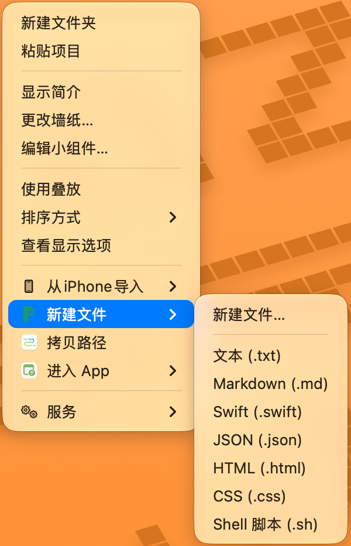
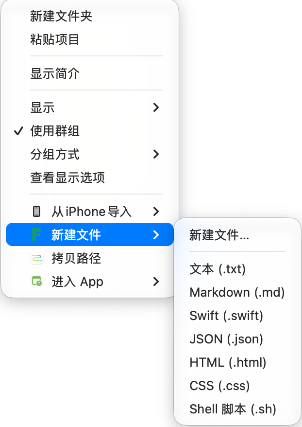
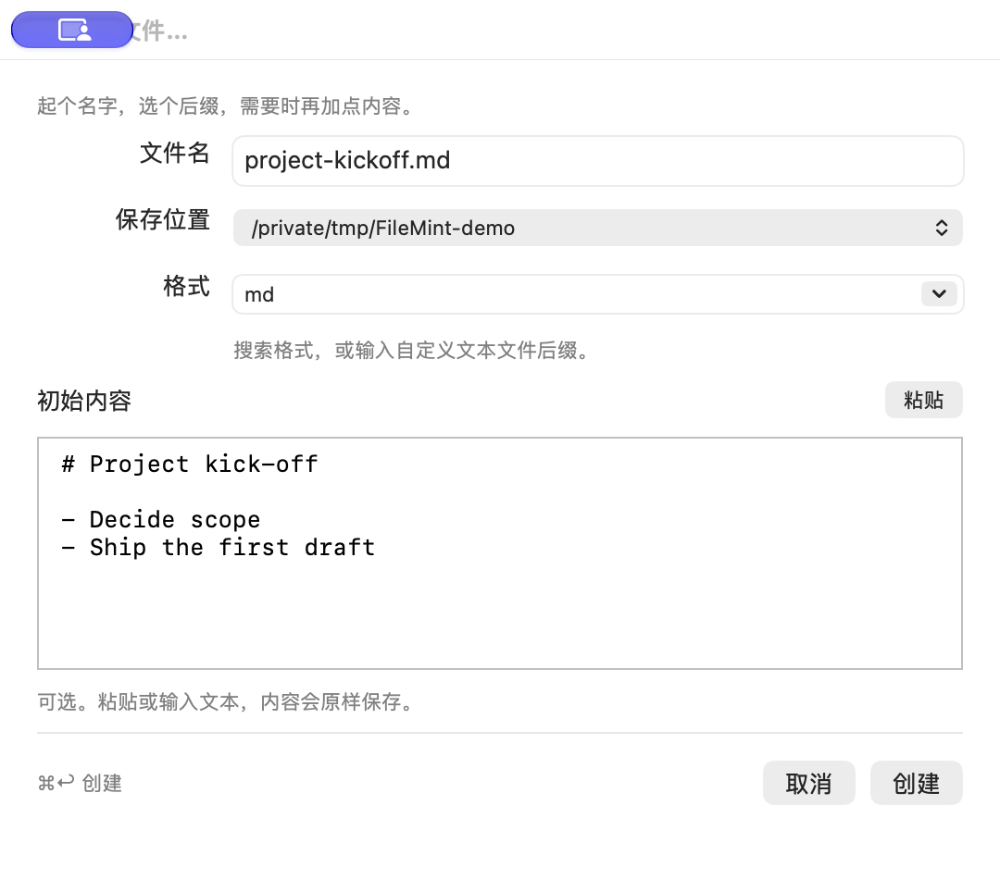

<h1 align="center">FileMint</h1>

<strong>A new file. Right here.</strong> A small, native macOS file creation utility.

<a href="README.md"><strong>← 简体中文</strong></a> ｜ <strong>English</strong>

<a href="https://github.com/FileMintApp/FileMint/releases/latest">Download for macOS</a> · <a href="docs/INSTALL.md">Installation help</a> · <a href="#roadmap">Roadmap</a> · <a href="https://github.com/FileMintApp/FileMint/issues">Report an issue</a>

Creating a file should not require opening an editor, choosing Save As, and finding your folder again.
**Right-click in Finder, choose a type, and your file is there.** Use a compact panel when you want to name it or paste content first.

## Create where you are already working

FileMint is available from the desktop and the background of an authorized Finder folder.
There is no detour through an editor, Save As, or a second folder chooser.

  
  

Desktop or Finder folder: right-click → New File → choose a type.

### When you need a name or starter content, use one compact panel

Set the full filename, suffix, destination and optional starter content before creation.
It is useful for Markdown, code, notes and configuration without first creating an empty file in another app.

  

### Keep only the file types you use

Enable, disable and reorder the built-in formats, then add your own text suffixes and starter templates.

  

Screenshots use the Chinese localization; FileMint follows the macOS language or can be set to English or Chinese.

## Small by design

- **Your filename, exactly.** Enter `demo.js` and save `demo.js`. The filename and extension selector stay in sync.
- **One-click presets.** Text, Markdown, JSON, Swift, HTML, CSS and Shell; enable CSV, YAML, XML, JavaScript, TypeScript, Python and SQL when needed.
- **Your own types.** Save suffixes such as `.toml`, `.vue` and `.log`, optional starter content, and your preferred menu order.
- **Paste before creating.** Notes, code and configuration go straight into the creation panel. Edited content, including Unicode, line breaks and literal template tokens, is saved verbatim.
- **Ready when you log in.** Launch at login and the menu bar item are enabled by default after installation and first launch. Both can be disabled in General.
- **Your language.** Follow the system language or choose English / Chinese. The Finder entry combines the FileMint logo with the localized New File label; type rows remain text only.
- **Native and focused.** Swift, AppKit and SwiftUI. Offline file creation, text-only menus, native editing, no web runtime, account or background scanning.
- **Low-frequency update checks.** Check automatically at most once every 7 days, enabled by default and optional in General. Manual checks remain in About and the menus. Choose when to update; builds with the new updater install and restart automatically.
- **Safe collisions.** Quick creation increments names; custom creation asks before replacement. Concurrent requests never silently overwrite one another.

## Use it

Right-click the desktop background or a folder background in Finder → **New File** → choose a type.

For a custom file: **New File…** → type `demo.js` → paste optional content → **Create**.

`Tab` moves focus, `⌘V` pastes, `⌘↩` creates and `Esc` cancels. Return inserts a newline in the content editor. The app and menu bar also offer creation through a folder picker, without Finder integration.

Custom suffixes produce **UTF-8 text**. Renaming a suffix does not create a valid PDF, image or Office document.

## Roadmap

Keep making everyday file creation a little easier. These TODOs are grouped by use case. Unchecked features are still planned work, and the list will evolve with everyday use and feedback.

<!-- #region roadmap -->

### Templates and naming

- [ ] **Multiple templates per format** — Keep meeting notes, project readmes and other templates for the same format.
- [ ] **Duplicate and preview templates** — Start from an existing template and preview the filename and initial content.
- [ ] **Filename rules** — Build names from dates, project names and other fields, with a preview of the result.
- [ ] **Import and export templates** — Back up, move and share templates, choosing how to handle conflicts on import.
- [ ] **Document templates** — Create copies of your own Word, Excel and other documents, preserving their format and content.

### Creation and next steps

- [ ] **Create from the clipboard** — Bring copied text into the creation panel, name it and save it as a file.
- [ ] **Paste images as files** — Save a copied screenshot or image directly into the current folder.
- [ ] **Open after creation** — Continue working in the default app or an editor you choose.

### Folders and tool integrations

- [ ] **Project folder templates** — Create a familiar folder structure and starter files in one action.
- [ ] **Copy names and paths** — Quickly copy the names or full paths of one or more files.
- [ ] **Open tools in the current folder** — Continue in your preferred terminal or editor at the current location.
- [ ] **Shortcuts and launcher integrations** — Open a prefilled creation panel from Shortcuts, Raycast or Alfred.

### Finding templates and everyday use

- [ ] **Template groups and favorites** — Group templates by purpose, pin favorites and find them through search.
- [ ] **First-file walkthrough** — Follow clear steps from enabling the extension and authorizing a folder to creating your first file.
- [ ] **Troubleshooting and compatibility notes** — Get specific help when menus or creation fail, with verified cloud-folder and external-drive notes.

<!-- #endregion roadmap -->

Implementation notes and completion criteria live in the [implementation roadmap (Chinese)](docs/ROADMAP.md). Share recurring file-creation needs through [Issues](https://github.com/FileMintApp/FileMint/issues), or contribute templates, translations and reproduction steps.

## Install

**macOS 13+**, Apple silicon and Intel in one universal DMG.

**The 0.5.4 installer is Developer ID signed, Apple notarized and stapled.** Enabling the Finder extension and authorizing working folders remain separate first-use steps.

1. [Download the latest DMG](https://github.com/FileMintApp/FileMint/releases/latest) and drag FileMint into Applications.
2. Launch it, enable the Finder extension and authorize your working folders.
3. Create from Finder.

In builds with the new updater, choose **About → Check for Updates → Update and Restart**.
FileMint downloads, verifies, replaces the app and restarts. Finish creating or
editing files first; macOS may request administrator authorization.
Older updater builds (including 0.5.4) need one manual installation of an enabled
build: open the DMG, quit FileMint, replace it in Applications, eject the volume
and reopen the installed app.

When upgrading from 0.3.0–0.5.0, download the new installer in your browser first:
the old in-app downloader can produce a sandbox execution block. See the
[update instructions](docs/INSTALL.md).

**Distribution and provenance:** FileMint is distributed through GitHub Releases with a SHA-256 checksum. Version 0.5.3 is Developer ID signed and was released while Apple notarization was still in progress. Apple later accepted the same DMG submission and published its ticket online for Gatekeeper. The public asset retains its original bytes and checksum, so it has no embedded (stapled) ticket: Gatekeeper can retrieve the online ticket when connected, while a first launch offline may still be blocked. Versions through 0.5.1 were built by GitHub Actions with GitHub build attestations, but use ad-hoc signatures and have no Apple notarization; locally built releases do not claim GitHub Actions build provenance. Stable versions after 0.5.3 must be notarized and stapled before publication. The Finder extension still needs to be enabled in System Settings. Read [installation and limitations](docs/INSTALL.md) first.

## Private by design

No telemetry or uploads of filenames, paths or content. Clipboard access happens only when you paste. GitHub connections are used for optional low-frequency automatic checks, manual checks and user-requested downloads. Automatic checks default on and can be disabled in General. No account or subscription. [Privacy policy](PRIVACY.md).

## Special Thanks

Thank you to [阿逼 (@bibinocode)](https://github.com/bibinocode) for helping with FileMint's Developer ID signing and Apple notarization submission.

## Buy me a coffee

If FileMint saves you a few interruptions, optional donations are welcome. Non-commercial use is free and all features remain available regardless of donations. A donation does not purchase commercial rights. Thank you!

  &nbsp;&nbsp;
  

## Source and license

Copyright: **XiaoDaiGua-Ray**. Developers: **XiaoDaiGua-Ray and GPT-Astra**.

**Personal and non-commercial use is free. Commercial use requires prior written authorization or a separately issued paid commercial license.**

| Use | Permission |
| --- | --- |
| Personal, educational and research use without commercial purpose | Free |
| Non-commercial forks, modifications and redistribution | Free; retain license and copyright notices |
| Business workflows, client work and paid services | Separate written authorization or paid commercial license |
| Commercial derivatives, paid distribution or product integration | Separate written authorization or paid commercial license |

FileMint uses its own [Non-Commercial Source License](LICENSE), **not MIT**. Source availability does not grant unrestricted commercial rights. See [commercial licensing](docs/COMMERCIAL_LICENSE.md).
Contributors can start with [development](docs/DEVELOPMENT.md), the [SPEC](specs/SPEC.md) and [acceptance evidence](docs/ACCEPTANCE.md).
